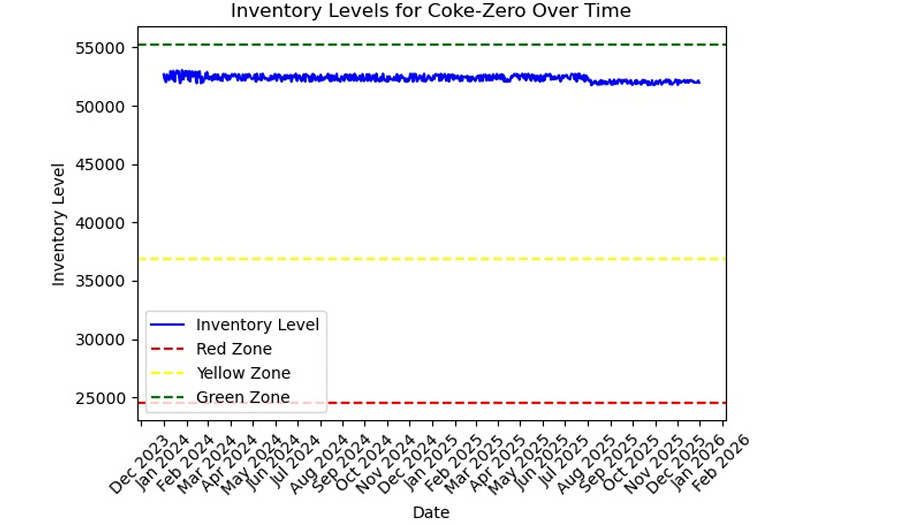

# 🧃 Beverage Demand Planning using Markov Chain Modeling

This project focuses on **forecasting seasonal beverage demand** using **Markov Chain modeling** to improve inventory decision-making in a demand-driven environment. The model simulates transitions between seasonal demand patterns and integrates buffer zone calculations to optimize replenishment.

---

## 🎯 Objective

- Predict demand trends across product lines and seasons.
- Use Markov Chains to model transitions between demand states.
- Calculate safety stock zones (Red, Yellow, Green) for optimal inventory control.
- Support demand-driven planning with data-backed strategy.

---

## 📊 Dataset Used

The dataset includes **daily demand data for 6 Coca-Cola variants**:
- Coke-Raspberry  
- Coke-Cherry  
- Coke-Vanilla  
- Coke-Zero  
- Diet-Coke  
- Coke-Lime  

Additional features:
- Seasonal labels (Summer, Fall, Winter, Spring)
- Daily observations over multiple cycles

The data was grouped by season to compute average seasonal demand per product.

---

## 🔄 Methodology

### Markov Chain for Demand Transition Modeling

We use a **first-order Markov Chain** to model how demand transitions between seasons:
- Each **season is a state**, and we estimate **transition probabilities** between these states based on historical frequency.
- This approach captures cyclic seasonality (e.g., Summer → Fall → Winter) and enables **probabilistic forecasting** for the next demand season.

Why Markov Chains?
- They effectively model systems with **state-based transitions**, making them ideal for **seasonal product demand cycles**.
- They provide a **structured yet interpretable way** to predict what demand "state" is likely to come next, improving forecast responsiveness.

### Buffer Zones Calculation

For each product:
- **Lead time** is randomly generated (5–15 days) to simulate replenishment delay.
- Based on **average daily demand** and lead time, we compute:
  - **Red Zone** = Basic safety stock (Lead Time × Avg Daily Demand)
  - **Yellow Zone** = Buffer for variability
  - **Green Zone** = Additional cushion for surge demand

These zones support **Demand Driven MRP (DDMRP)** strategies.

---

## 📈 Results & Insights

- Seasonal demand shows significant variation, with products like **Coke-Zero** and **Diet-Coke** showing higher seasonal dependency.
- Transition matrix from the Markov model identifies **most likely seasonal shifts**, e.g., Fall → Winter (0.33), Summer → Fall (0.25).
- Calculated buffer zones provide actionable stocking targets:
  - Red Zone: base demand coverage
  - Yellow Zone: variability buffer
  - Green Zone: safety cushion

This results in a **data-backed, season-aware replenishment strategy** tailored to each product.

### 📊 Inventory Behavior by Product

Each product was tracked over time to assess how well inventory levels aligned with the buffer zones (Red, Yellow, Green). The plots below visualize inventory behavior for each SKU across multiple seasons.

---

### 🥤 Coke-Raspberry

- Maintained stable inventory above the red zone throughout the simulation.
- Minor dips below green zone occurred in mid-2025.
- Well-buffered system with minimal risk of stockouts.

---

### 🥤 Coke-Cherry

- Inventory remained stable for most of the timeline.
- Drop in mid-2025 brought levels close to yellow zone.
- Performance was within acceptable tolerances.

---

### 🥤 Coke-Vanilla

- Consistently maintained above green zone.
- Very low fluctuation; strong alignment with replenishment goals.

---

### 🥤 Coke-Zero

- Seasonal dips were observed but stayed above red zone.
- Buffer zones effectively absorbed demand variation.

---

### 🥤 Diet-Coke

- Stable, high inventory across the timeline.
- No breaches into yellow/red zones, showing ideal control.

---

### 🥤 Coke-Lime

- Closely aligned to green zone with minimal fluctuation.
- Demonstrates excellent control and accurate lead-time setting.

---

## 🛠 Tools & Technologies

- Python (pandas, numpy, matplotlib)
- Markov Chain modeling
- Inventory management logic using demand-driven principles

---

## 📁 Repository Structure

